# Know Studio

Know Studio 是一个基于 Spring Boot 3.5、Spring AI、Spring AI Alibaba、PostgreSQL pgvector、Elasticsearch、MinIO 和 React 的全栈知识库系统。它围绕企业知识沉淀、权限协作、文档入库、混合检索、证据问答和 AI 助手工具调用构建，覆盖从后端 RAG 链路到前端 Chat UI 与管理后台的完整实现。

系统包含 Chat UI、管理后台、组织协作、用户权限、文档解析入库、向量与关键词双通道召回、RRF 融合、引用来源、会话记忆和 Docker 本地部署能力，可作为企业知识助手的基础工程骨架。

## 预览

### Chat UI

<table>
  <tr>
    <td>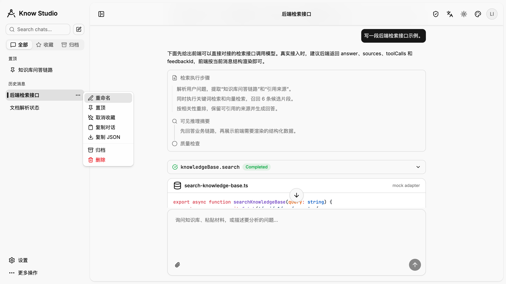</td>
  </tr>
  <tr>
    <td>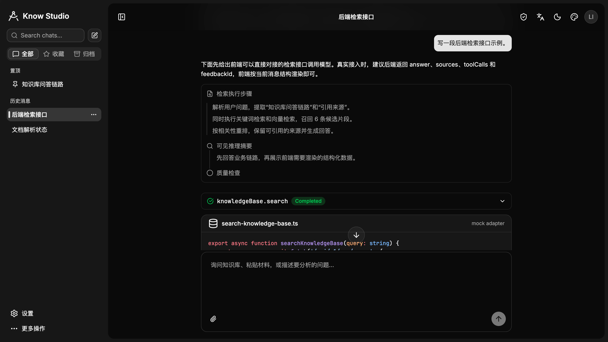</td>
  </tr>
</table>

### 管理后台

<table>
  <tr>
    <td width="50%">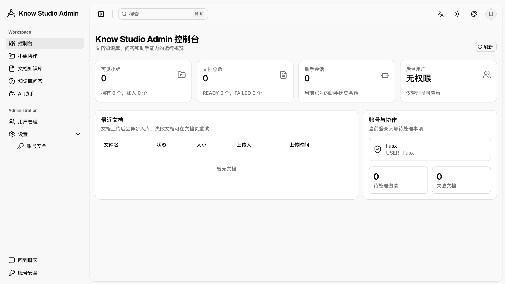</td>
    <td width="50%">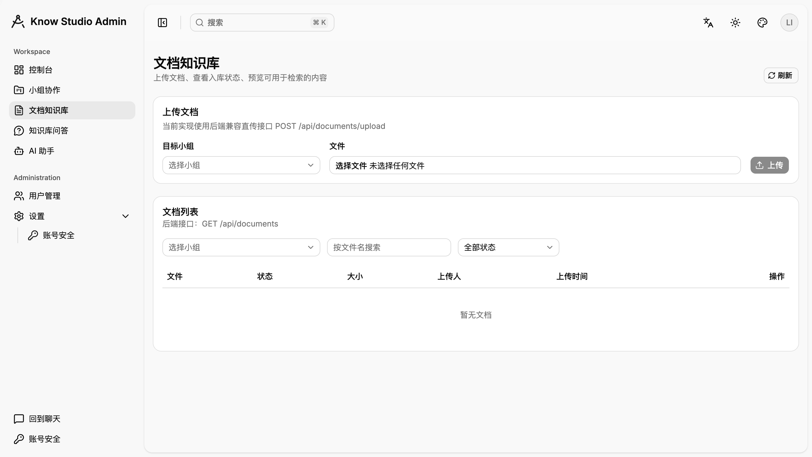</td>
  </tr>
</table>

### 登录注册

<table>
  <tr>
    <td width="50%">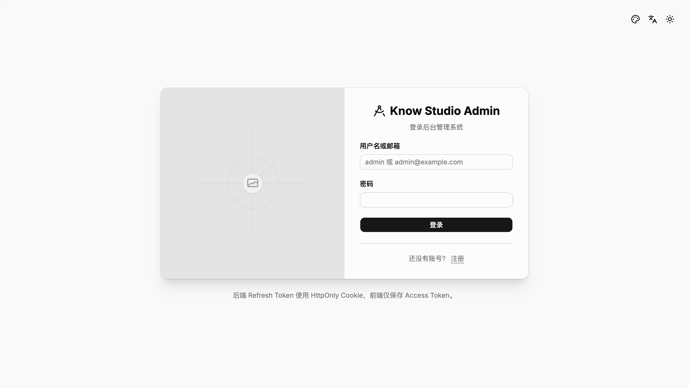</td>
    <td width="50%">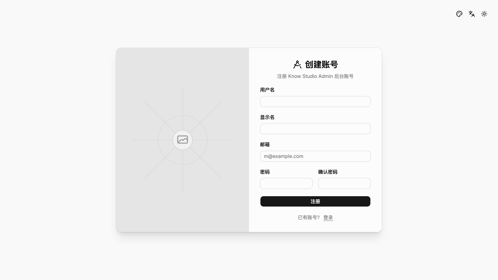</td>
  </tr>
</table>

### 主题

<table>
  <tr>
    <td width="50%">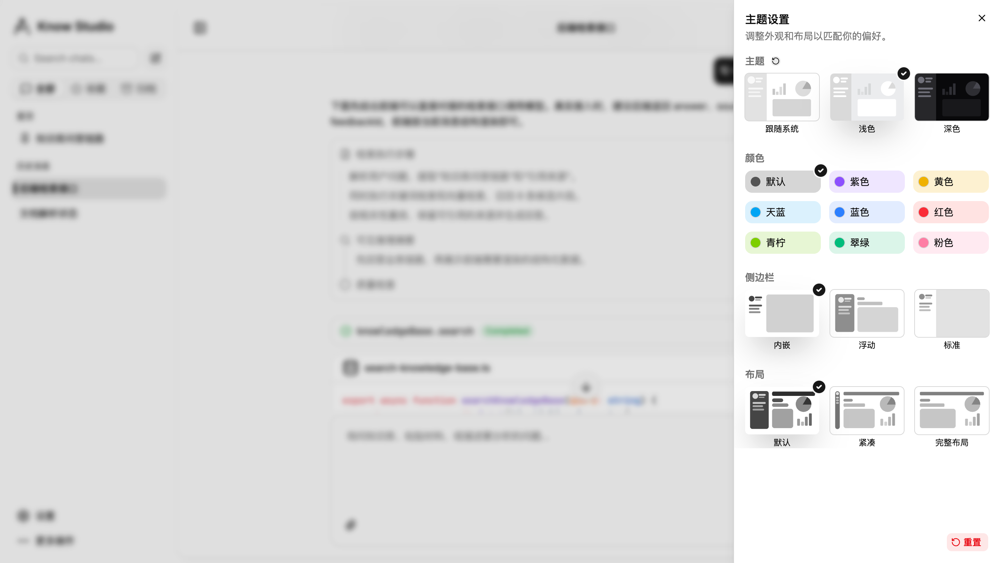</td>
    <td width="50%">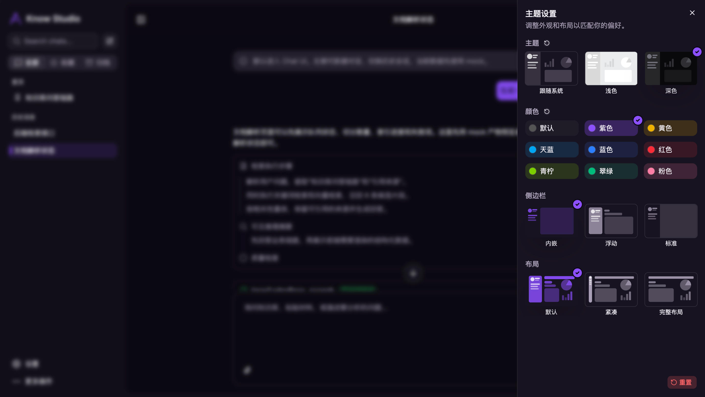</td>
  </tr>
  <tr>
    <td width="50%">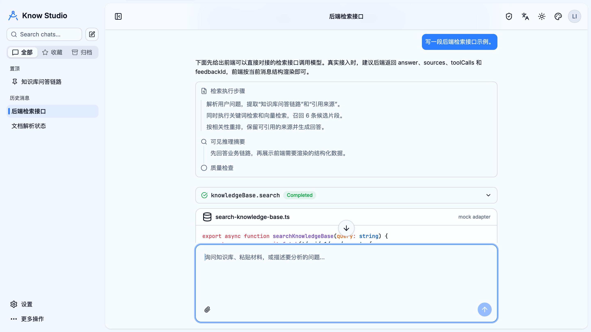</td>
    <td width="50%">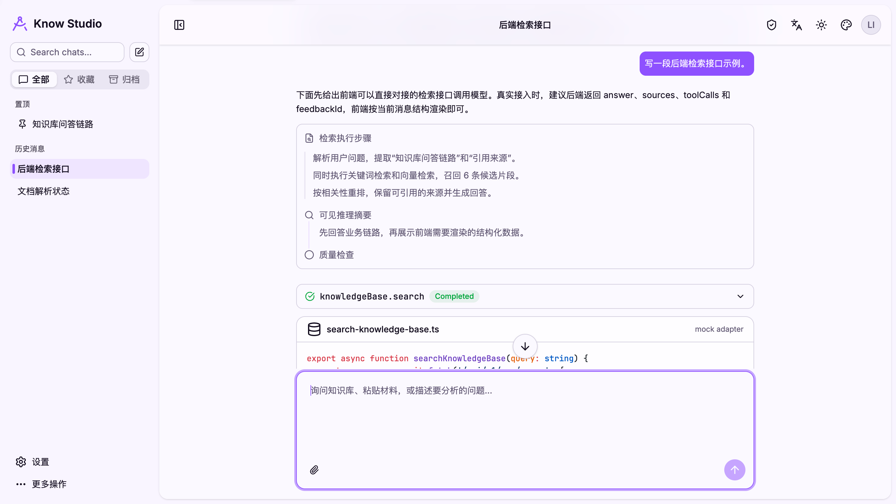</td>
  </tr>
  <tr>
    <td width="50%">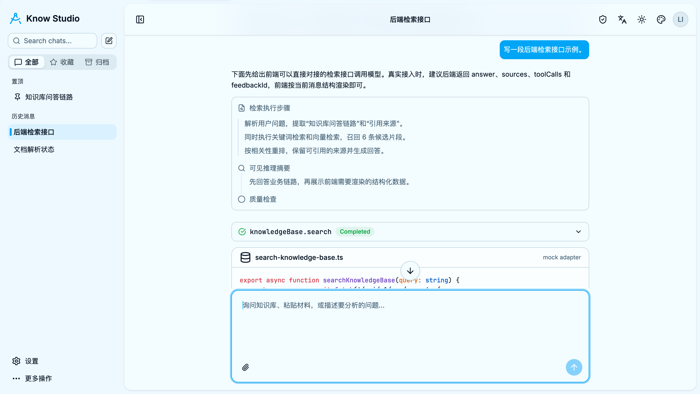</td>
    <td width="50%">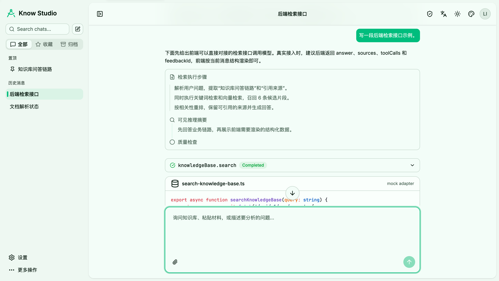</td>
  </tr>
  <tr>
    <td width="50%">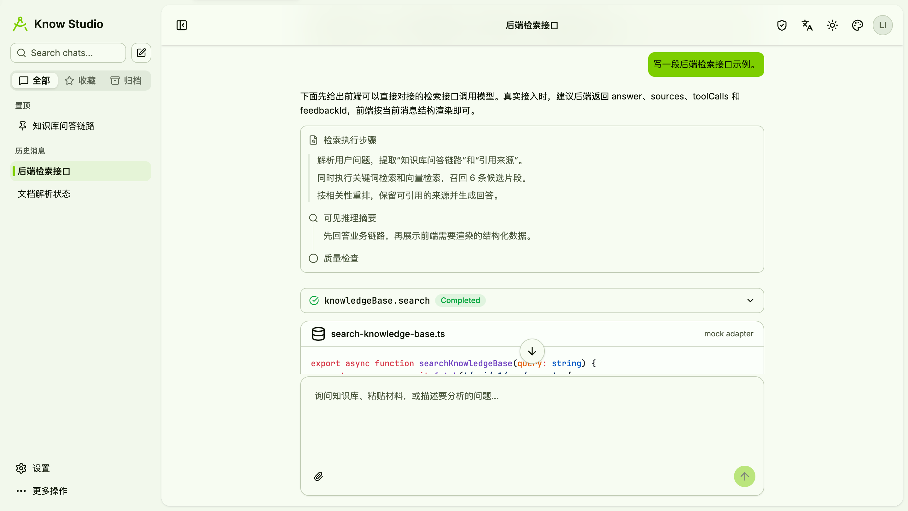</td>
    <td width="50%">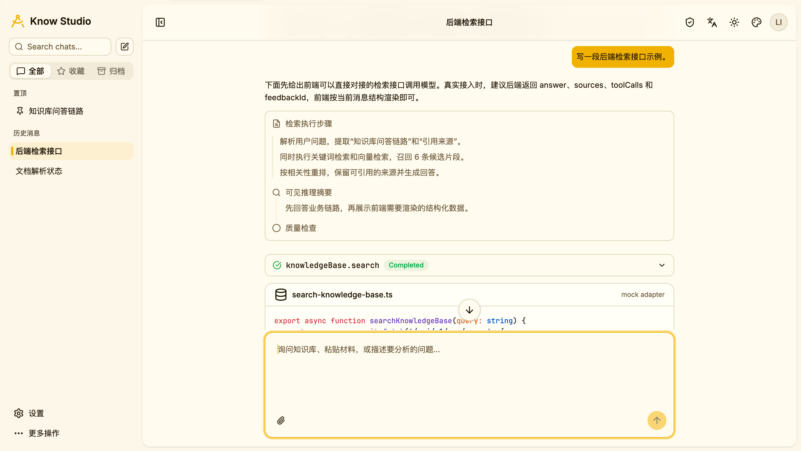</td>
  </tr>
  <tr>
    <td width="50%">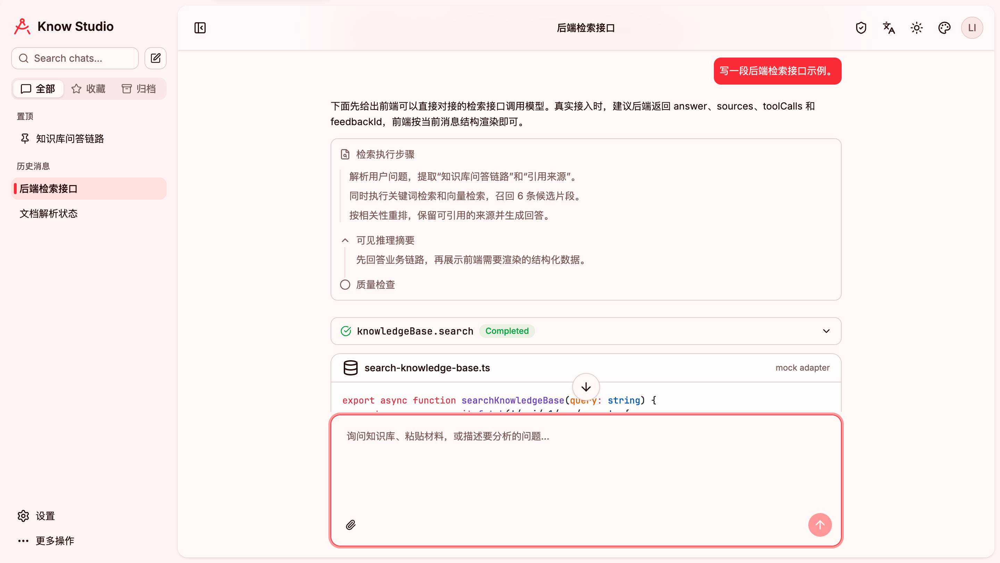</td>
    <td width="50%">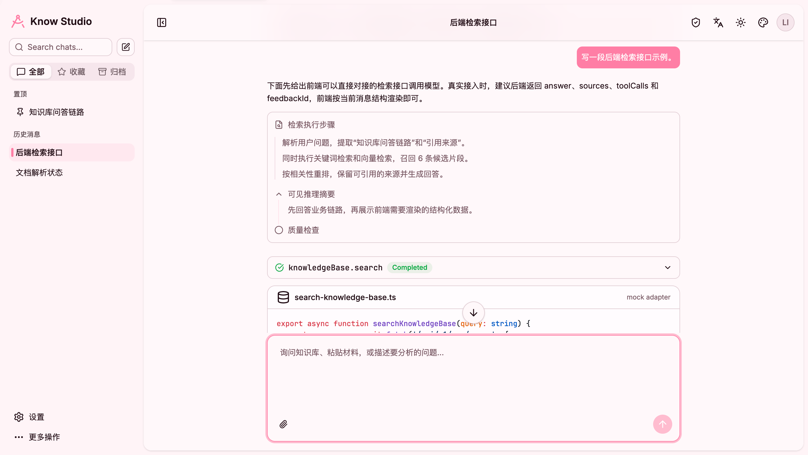</td>
  </tr>
</table>

## 功能概览

- Chat-first 入口：默认进入知识库问答界面。
- 管理后台：管理用户、协作组、文档、QA、助手会话和系统设置。
- 组织权限：系统角色与组内角色分离，控制知识库可见范围。
- 文档入库：上传、存储、解析、清洗、切片、向量化和关键词索引。
- 混合检索：pgvector 语义检索 + Elasticsearch BM25 关键词检索。
- 证据问答：基于检索证据生成回答，支持引用来源。
- 助手工具调用：Chat 助手可调用知识库检索工具。
- 会话记忆：持久化消息、摘要和压缩后的上下文。
- Docker 开发环境：PostgreSQL、pgvector、Elasticsearch、IK、MinIO、Ollama、后端和前端一键启动。

## 技术栈

### 后端

- Java 21
- Spring Boot 3.5
- Spring AI 1.1
- Spring AI Alibaba 1.1
- MyBatis-Plus
- Flyway
- PostgreSQL + pgvector
- Elasticsearch 8 + IK Analyzer
- MinIO
- JWT + Refresh Token

### 前端

- React 19
- TypeScript
- Vite
- TanStack Router
- shadcn/ui radix-nova
- Tailwind CSS v4
- prompt-kit 风格 Chat UI 组件
- motion 动画

### AI 能力

- DashScope Chat Model
- Ollama Embedding Model
- pgvector 向量检索
- Elasticsearch 关键词索引
- ReAct 风格工具调用

## 系统架构

```text
Browser
  |
  v
know-studio-ui
  |
  v
Spring Boot API
  |
  +-- Auth / User / Admin
  +-- Groups / Membership / Permissions
  +-- Documents / Upload / Preview
  +-- Ingestion Pipeline
  |     +-- MinIO 原文存储
  |     +-- Parser / Cleaner / Chunker
  |     +-- PostgreSQL 元数据与切片
  |     +-- pgvector embedding
  |     +-- Elasticsearch keyword index
  +-- QA
  |     +-- Query Planning
  |     +-- Vector Retrieval
  |     +-- Keyword Retrieval
  |     +-- RRF Fusion
  |     +-- Evidence Assembly
  +-- Assistant
        +-- Session Memory
        +-- Tool Mode
        +-- Knowledge Base Search Tool
```

## Docker 快速启动

### 1. 配置模型 Key

Chat 生成使用 DashScope。启动前在当前 shell 中设置环境变量：

```bash
export DASHSCOPE_API_KEY=your-dashscope-api-key
```

项目会从以下位置读取该变量：

- `docker-compose.yml`
- `src/main/resources/application-dev.yml`

不要把真实 API Key 提交到仓库。

### 2. 启动服务

```bash
docker compose up -d --build
```

首次启动会构建 Elasticsearch IK 镜像、安装依赖、创建数据卷，并拉取 Ollama embedding 模型，耗时会比较长。

### 3. 访问地址

```text
前端：        http://localhost:5173
后端：        http://localhost:18080
健康检查：    http://localhost:18080/actuator/health
MinIO：       http://localhost:9001
Elasticvue：  http://localhost:8088
Elasticsearch http://localhost:9200
Ollama：      http://localhost:11434
```

### 4. 开发默认账号

```text
用户名：admin
密码：Admin@123456
```

Chat UI 可以直接打开。进入管理后台时，根据路由和权限配置可能需要登录。

## 本地前端开发

```bash
cd know-studio-ui
pnpm install
pnpm dev
```

前端默认通过 `/api` 访问后端。Docker 环境下由 Vite 代理到后端容器；本地开发时可查看或设置 `know-studio-ui/vite.config.ts` 中的 `VITE_DEV_PROXY_TARGET`。

常用命令：

```bash
cd know-studio-ui
pnpm lint
pnpm build
```

## 本地后端开发

先启动基础依赖：

```bash
docker compose up -d postgres elasticsearch minio ollama ollama-model-init elasticvue
```

再启动 Spring Boot：

```bash
export DASHSCOPE_API_KEY=your-dashscope-api-key
mvn spring-boot:run -Dspring-boot.run.profiles=dev
```

`dev` 配置默认连接：

- PostgreSQL：`localhost:5433`
- Elasticsearch：`localhost:9200`
- MinIO：`localhost:9000`
- Ollama：`localhost:11434`

## 项目结构

```text
know-studio
├─ know-studio-ui             # 当前 React 前端
├─ src/main/java/com/dong/ddrag
│  ├─ auth                    # 认证与 token
│  ├─ user                    # 用户与后台管理
│  ├─ identity                # 当前用户上下文
│  ├─ groupmembership         # 协作组、成员、邀请、申请
│  ├─ document                # 文档上传、查询、预览
│  ├─ ingestion               # 解析、清洗、切片、向量入库
│  ├─ retrieval               # pgvector / Elasticsearch 检索适配
│  ├─ qa                      # RAG 问答链路
│  ├─ assistant               # AI 助手、会话、记忆、工具
│  ├─ storage                 # MinIO 对象存储
│  └─ common                  # 公共响应、枚举、异常
├─ src/main/resources
│  ├─ db/migration            # Flyway 迁移
│  ├─ mapper                  # MyBatis XML
│  └─ prompts                 # Prompt 模板
├─ docker                     # 自定义 Docker 资源
├─ deploy/two-node            # 双机部署示例
└─ docs                       # 技术文档
```

## 常用命令

```bash
# 启动所有服务
docker compose up -d --build

# 停止服务
docker compose down

# 停止服务并删除项目数据卷
docker compose down -v

# 后端打包
mvn -q -DskipTests package

# 前端检查
cd know-studio-ui && pnpm lint && pnpm build
```

## 配置说明

- `DASHSCOPE_API_KEY`：Chat 生成必需。
- `KNOW_STUDIO_JWT_SECRET`：生产环境应显式配置。
- MinIO 本地默认账号：`minioadmin / minioadmin`。
- PostgreSQL 本地默认配置：数据库 `know_studio`，用户 `root`，密码 `123456`。
- 文档默认存储桶：`know-studio-documents`。

## 文档

- `docs/API.md`：接口说明。
- `docs/PROJECT_READING_GUIDE.md`：代码阅读路线。
- `docs/code-walkthrough.md`：实现走读。
- `docs/rag-from-scratch.md`：RAG 设计说明。
- `docs/run-in-idea.md`：IDEA 本地启动说明。
- `deploy/two-node/README.md`：双机部署说明。

## License

当前仓库根目录未声明独立 License。二次分发前请检查第三方依赖协议以及 `know-studio-ui/LICENSE`。
