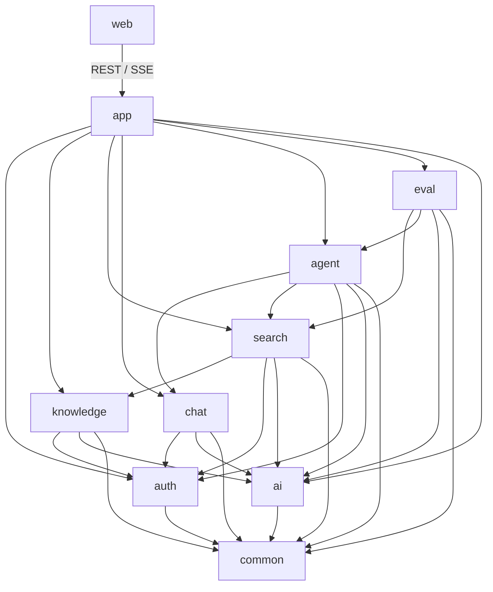

# Target Project Structure

## Status

This document defines the implemented repository-level structure for Know Studio and the package-level direction for future development. The module moves and package renames were completed incrementally with backend and frontend quality gates kept green.

The target is a Maven modular monolith organized by recognizable business capabilities. Module names intentionally use short, conventional terms and avoid framework-specific or DDD-specific terminology.

## Root Directory

```text
know-studio/
├── pom.xml                   Maven parent project, dependency versions, plugins, and backend modules
├── README.md                 Project introduction, prerequisites, local startup, and common commands
├── .env.example              Safe environment-variable template without real credentials
├── .gitignore                Git ignore rules
├── docker-compose.yml        Local development dependencies and optional observability services
│
├── common/                   Minimal code shared by backend modules
├── auth/                     Users, login, Teams, roles, and resource permissions
├── ai/                       Chat, embedding, rerank, provider routing, fallback, and AI telemetry
├── knowledge/                KnowledgeBases, documents, parsing, chunking, embedding, and indexing
├── search/                   Query planning, hybrid search, fusion, rerank, and evidence grading
├── chat/                     Sessions, messages, conversation memory, summaries, and context windows
├── agent/                    Agent definitions, runtime, planning, tools, MCP, and streamed answers
├── eval/                     Search, RAG, answer, and Agent quality evaluation
├── app/                      Executable Spring Boot application, configuration, and module assembly
│
├── web/                      React frontend for users and administrators
├── deploy/                   Docker images, database scripts, monitoring, and environment templates
├── docs/                     Architecture, API, development, and deployment documentation
├── scripts/                  Development, verification, migration, and operations scripts
└── archive/                  Historical code retained only for reference
```

## Architecture Overview



RAG is a runtime capability rather than a top-level Maven module:

```text
Agent
→ KnowledgeSearchTool
→ Search
→ Knowledge
→ AI
→ Grounded answer
```

This allows the same Agent runtime to support direct chat, RAG, MCP tools, business tools, and future workflows without turning a `rag` module into a general-purpose container.

## Maven Modules

The root `pom.xml` should eventually declare modules in dependency order:

```xml
<modules>
    <module>common</module>
    <module>auth</module>
    <module>ai</module>
    <module>knowledge</module>
    <module>search</module>
    <module>chat</module>
    <module>agent</module>
    <module>eval</module>
    <module>app</module>
</modules>
```

`web` remains an independent Node.js project and is not part of the Maven reactor.

## Dependency Rules

| Module | Allowed internal dependencies |
|---|---|
| `common` | None |
| `auth` | `common` |
| `ai` | `common` |
| `knowledge` | `common`, `auth`, `ai` |
| `search` | `common`, `auth`, `knowledge`, `ai` |
| `chat` | `common`, `auth`, `ai` |
| `agent` | `common`, `auth`, `ai`, `chat`, `search` |
| `eval` | `common`, `ai`, `search`, `agent` |
| `app` | All backend modules |

Mandatory rules:

1. Circular module dependencies are forbidden.
2. Cross-module calls use the target module's `api` package.
3. A module must not access another module's Mapper, Repository, Entity, or infrastructure implementation.
4. `common` must not depend on a business module.
5. `ai` must not contain KnowledgeBase, Search, Chat, or Agent business rules.
6. `search` returns evidence and must not generate the final user answer.
7. `chat` manages conversation state and must not decide which Agent tool to call.
8. `agent` coordinates capabilities but must not implement database, search-engine, or model-provider details.
9. `eval` may call online module APIs, but online modules must not depend on `eval`.
10. `app` is the composition root and must not accumulate business logic.

## Common Module Pattern

Business modules use a familiar, lightweight structure. Directories are created only when needed.

```text
<module>/
├── pom.xml                       Maven module definition
├── src/main/java/know/studio/<module>/
│   ├── api/                      Public interfaces and cross-module contracts
│   ├── controller/               HTTP endpoints owned by the module
│   ├── service/                  Business workflows and transaction boundaries
│   ├── model/
│   │   ├── entity/               Persistent or business entities
│   │   ├── request/              HTTP or application request types
│   │   └── response/             HTTP or application response types
│   ├── repository/               Business-oriented persistence access
│   ├── mapper/                   MyBatis Mapper interfaces
│   ├── adapter/                  External technology implementations when applicable
│   ├── config/                   Module-specific Spring configuration
│   ├── event/                    Events published or consumed by the module
│   ├── enums/                    Module-specific enumerations
│   └── exception/                Module-specific exceptions
├── src/main/resources/
│   ├── mapper/                   MyBatis XML mappings
│   └── prompts/                  Prompt resources owned by the module
└── src/test/java/                Unit and module integration tests
```

The structure is deliberately conventional. More specialized directories such as `planning`, `tool`, or `memory` are introduced only when they describe a real capability.

## `common`

Purpose: minimal backend foundations that have no business ownership.

```text
common/
├── pom.xml                               Common module build configuration
└── src/main/java/know/studio/common/
    ├── response/
    │   ├── ApiResponse.java              Standard API response envelope
    │   ├── PageRequest.java              Shared pagination request
    │   └── PageResult.java               Shared pagination result
    ├── exception/
    │   ├── BusinessException.java        Base business exception
    │   ├── NotFoundException.java        Resource-not-found exception
    │   ├── ForbiddenException.java       Permission-denied exception
    │   └── ErrorCode.java                Stable error-code contract
    ├── context/
    │   ├── CurrentUser.java              Framework-neutral current-user value
    │   └── UserContext.java              Current-user access abstraction
    ├── event/
    │   └── BaseEvent.java                Base application event contract
    ├── util/                             Utilities with no business meaning
    └── constant/                         Constants genuinely shared by several modules
```

The module must not contain KnowledgeBase, Document, Evidence, Conversation, Agent, provider, Mapper, or module-specific helper types.

## `auth`

Purpose: identity, authentication, Teams, roles, and authorization.

```text
auth/
├── pom.xml                               Auth module build configuration
├── src/main/java/know/studio/auth/
│   ├── api/
│   │   ├── AuthApi.java                  Current identity and authentication operations
│   │   ├── AccessApi.java                Resource-level permission checks
│   │   ├── CurrentPrincipal.java         Authenticated user and role information
│   │   ├── AccessScope.java              KnowledgeBase IDs readable by a user
│   │   └── PermissionType.java           READ and MANAGE permissions
│   ├── controller/
│   │   ├── AuthController.java           Register, login, logout, and current-user endpoints
│   │   ├── UserController.java           User administration endpoints
│   │   └── TeamController.java           Team and membership endpoints
│   ├── service/
│   │   ├── AuthService.java              Authentication workflow
│   │   ├── UserService.java              User management
│   │   ├── TeamService.java              Team and membership management
│   │   └── AccessService.java            Permission decisions
│   ├── model/entity/
│   │   ├── UserEntity.java               User persistence entity
│   │   ├── TeamEntity.java               Team persistence entity
│   │   ├── TeamMemberEntity.java         Team membership entity
│   │   └── GrantEntity.java              KnowledgeBase grant entity
│   ├── repository/                       Auth persistence operations
│   ├── mapper/                           Auth MyBatis Mappers
│   ├── security/
│   │   ├── SaTokenSessionService.java    Sa-Token login and logout adapter
│   │   ├── SaTokenUserProvider.java      Sa-Token current-user adapter
│   │   └── PasswordService.java          Password hashing and verification
│   ├── config/                           Auth-specific configuration
│   ├── enums/                            User and role states
│   └── exception/                        Auth-specific errors
└── src/main/resources/mapper/auth/       Auth MyBatis XML mappings
```

Sa-Token classes are restricted to `auth.security` and `app.security`. Other modules call `AccessApi` instead of calling `StpUtil` directly.

## `ai`

Purpose: provider-independent AI access and provider routing.

```text
ai/
├── pom.xml                               AI module build configuration
└── src/main/java/know/studio/ai/
    ├── api/
    │   ├── ChatModel.java                Chat generation interface
    │   ├── EmbeddingModel.java           Embedding interface
    │   ├── RerankModel.java              Rerank interface
    │   ├── ChatRequest.java              Provider-neutral Chat request
    │   ├── ChatMessage.java              Typed model message
    │   ├── MessageRole.java              SYSTEM, USER, ASSISTANT, and tool roles
    │   ├── ChatChunk.java                Streamed model output
    │   └── ModelProfile.java             Bounded generation settings
    ├── routing/
    │   ├── ChatModelRouter.java          Chat provider routing
    │   ├── EmbeddingModelRouter.java     Embedding provider routing
    │   ├── RerankModelRouter.java        Rerank provider routing
    │   ├── ProviderSelector.java         Provider priority selection
    │   └── CircuitBreaker.java           Provider failure isolation and recovery
    ├── provider/
    │   ├── dashscope/                    DashScope Chat implementation
    │   ├── ollama/                       Ollama Chat and embedding implementation
    │   └── rerank/                       HTTP rerank implementation
    ├── prompt/
    │   ├── PromptLoader.java             UTF-8 classpath prompt loader
    │   ├── PromptTemplate.java           Template rendering helper
    │   └── PromptInfo.java               Prompt identifier and version
    ├── monitor/
    │   ├── AiMetrics.java                Low-cardinality AI metrics
    │   └── AiTrace.java                  AI call tracing
    ├── config/                           AI provider configuration
    └── exception/                        Provider and routing errors
```

Business prompt content remains in the owning module. The AI module provides only loading, message, routing, resilience, and observation capabilities.

## `knowledge`

Purpose: KnowledgeBase and document lifecycle, including document processing and index writing.

```text
knowledge/
├── pom.xml                                   Knowledge module build configuration
├── src/main/java/know/studio/knowledge/
│   ├── api/
│   │   ├── KnowledgeApi.java                 Knowledge write operations
│   │   ├── KnowledgeQueryApi.java            KnowledgeBase, document, and Chunk queries
│   │   ├── KnowledgeBaseInfo.java            Public KnowledgeBase projection
│   │   ├── DocumentInfo.java                 Public document projection
│   │   └── ChunkInfo.java                    Public Chunk projection
│   ├── controller/
│   │   ├── KnowledgeController.java          KnowledgeBase endpoints
│   │   └── DocumentController.java           Document endpoints
│   ├── service/
│   │   ├── KnowledgeService.java             KnowledgeBase workflow
│   │   ├── DocumentService.java              Document lifecycle
│   │   ├── UploadService.java                Upload workflow
│   │   └── ProcessService.java               Document-processing orchestration
│   ├── model/entity/
│   │   ├── KnowledgeBaseEntity.java          KnowledgeBase persistence entity
│   │   ├── DocumentEntity.java               Document persistence entity
│   │   ├── DocumentVersionEntity.java        Document version entity
│   │   └── ChunkEntity.java                  Chunk persistence entity
│   ├── process/
│   │   ├── DocumentProcessor.java            Document-processing entry point
│   │   ├── parser/                           Tika and format-specific parsers
│   │   ├── chunker/                          Fixed and structure-aware chunking strategies
│   │   ├── embedder/                         Embedding step using the AI API
│   │   └── indexer/                          Search-index writing
│   ├── storage/
│   │   ├── ObjectStorage.java                Object-storage abstraction
│   │   └── MinioStorage.java                 MinIO implementation
│   ├── messaging/
│   │   ├── DocumentProducer.java             Document-processing task publisher
│   │   └── DocumentConsumer.java             Document-processing task consumer
│   ├── repository/                           Knowledge persistence operations
│   ├── mapper/                               Knowledge MyBatis Mappers
│   ├── config/                               Knowledge configuration
│   ├── enums/                                Document and processing states
│   └── exception/                            Knowledge-specific errors
├── src/main/resources/
│   ├── mapper/knowledge/                     Knowledge MyBatis XML mappings
│   └── prompts/knowledge/                    Document enrichment prompts, if required
└── src/test/java/                            Knowledge tests
```

The initial target keeps document processing inside `knowledge`. It can later become an independent worker if ingestion volume requires separate deployment and scaling.

## `search`

Purpose: convert a question and authorized KnowledgeBase scope into structured evidence.

```text
search/
├── pom.xml                               Search module build configuration
├── src/main/java/know/studio/search/
│   ├── api/
│   │   ├── SearchApi.java                Search entry point
│   │   ├── SearchRequest.java            Question and authorized scope
│   │   ├── SearchOptions.java            Search mode and limits
│   │   ├── Evidence.java                 Single evidence item
│   │   └── EvidenceResult.java           Ranked evidence and evidence level
│   ├── controller/
│   │   └── SearchController.java         Search debugging and direct-search endpoint
│   ├── service/
│   │   └── SearchService.java            Full search pipeline
│   ├── planning/
│   │   ├── QueryPlanner.java             Query-planning interface
│   │   ├── RuleQueryPlanner.java         Rule-based planner
│   │   └── LlmQueryPlanner.java          LLM planner
│   ├── channel/
│   │   ├── SearchChannel.java            Search-channel extension point
│   │   ├── VectorSearch.java             Vector search channel
│   │   └── KeywordSearch.java            Keyword search channel
│   ├── fusion/
│   │   ├── RrfFusion.java                Reciprocal rank fusion
│   │   └── ResultMerger.java             Candidate merge and deduplication
│   ├── rerank/
│   │   └── SearchReranker.java           Rerank step
│   ├── neighbor/
│   │   └── NeighborExpander.java         Neighbor Chunk expansion
│   ├── evidence/
│   │   └── EvidenceGrader.java           Evidence sufficiency grading
│   ├── adapter/
│   │   ├── pgvector/                     pgvector search implementation
│   │   └── elasticsearch/                Elasticsearch search implementation
│   ├── prompt/                           Query-planning prompt catalog
│   ├── config/                           Search configuration
│   └── exception/                        Search-specific errors
├── src/main/resources/prompts/search/    Search prompt resources
└── src/test/java/                        Search pipeline tests
```

Search stops at `EvidenceResult`; it does not produce the final natural-language answer.

## `chat`

Purpose: conversation persistence, memory, summaries, and model-ready context.

```text
chat/
├── pom.xml                                   Chat module build configuration
├── src/main/java/know/studio/chat/
│   ├── api/
│   │   ├── ChatApi.java                      Conversation operations
│   │   ├── ChatContext.java                  Context consumed by Agent
│   │   ├── ChatMessage.java                  Conversation message contract
│   │   └── MessageRole.java                  Message role contract
│   ├── controller/
│   │   └── ChatController.java               Create, list, rename, and delete conversations
│   ├── service/
│   │   ├── ChatService.java                  Conversation management
│   │   ├── MessageService.java               Message persistence
│   │   └── MemoryService.java                Context and summary management
│   ├── model/entity/
│   │   ├── ChatSessionEntity.java            Conversation persistence entity
│   │   ├── ChatMessageEntity.java            Message persistence entity
│   │   └── ChatSummaryEntity.java            Summary persistence entity
│   ├── memory/
│   │   ├── ContextBuilder.java               Model-ready context builder
│   │   ├── TokenLimitPolicy.java             Context token-budget policy
│   │   ├── SummaryPolicy.java                Summary trigger policy
│   │   └── SummaryGenerator.java             Summary generation
│   ├── repository/                           Conversation persistence operations
│   ├── mapper/                               Chat MyBatis Mappers
│   ├── prompt/                               Summary and title prompt catalogs
│   ├── config/                               Chat configuration
│   └── exception/                            Chat-specific errors
├── src/main/resources/
│   ├── mapper/chat/                          Chat MyBatis XML mappings
│   └── prompts/chat/                         Summary and title prompts
└── src/test/java/                            Chat and memory tests
```

Conversation messages should support `SYSTEM`, `USER`, `ASSISTANT`, `TOOL_CALL`, and `TOOL_RESULT`. Chat stores and prepares context; it does not select Agent tools.

## `agent`

Purpose: Agent configuration, decision-making, tool execution, MCP integration, and streamed answers.

```text
agent/
├── pom.xml                                   Agent module build configuration
├── src/main/java/know/studio/agent/
│   ├── api/
│   │   ├── AgentApi.java                     Agent execution API
│   │   ├── AgentManageApi.java               Agent definition management API
│   │   ├── AgentRequest.java                 Agent execution request
│   │   ├── AgentEvent.java                   Typed streamed Agent event
│   │   └── AgentInfo.java                    Public Agent definition projection
│   ├── controller/
│   │   ├── AgentController.java              Agent REST and SSE entry point
│   │   └── AgentManageController.java        Agent administration endpoints
│   ├── service/
│   │   ├── AgentService.java                 Agent execution use case
│   │   └── AgentManageService.java           Agent definition management
│   ├── runtime/
│   │   ├── AgentRunner.java                  Executes one Agent request
│   │   ├── AgentLoop.java                    Think, act, observe, and finish loop
│   │   ├── AgentContext.java                 Per-run context
│   │   ├── AgentState.java                   Run state
│   │   └── AgentStep.java                    Observable execution step
│   ├── planner/
│   │   ├── AgentPlanner.java                 Planning interface
│   │   ├── LlmAgentPlanner.java              LLM planning implementation
│   │   └── AgentPlan.java                    Planned next action
│   ├── tool/
│   │   ├── AgentTool.java                    Tool extension point
│   │   ├── ToolInfo.java                     Tool name, description, and schema
│   │   ├── ToolResult.java                   Tool execution result
│   │   ├── ToolRegistry.java                 Available-tool registry
│   │   ├── ToolExecutor.java                 Permission-aware tool executor
│   │   └── builtin/
│   │       ├── KnowledgeSearchTool.java       Search-backed RAG tool
│   │       └── DirectChatTool.java            Direct non-RAG response capability
│   ├── mcp/
│   │   ├── McpToolLoader.java                MCP tool discovery
│   │   ├── McpAgentTool.java                 MCP-to-Agent tool adapter
│   │   └── McpToolExecutor.java              MCP invocation
│   ├── model/entity/
│   │   ├── AgentEntity.java                  Agent definition entity
│   │   ├── AgentRunEntity.java               Agent run entity
│   │   └── AgentStepEntity.java              Agent step entity
│   ├── prompt/                               Planning, tool, and final-answer prompts
│   ├── repository/                           Agent persistence operations
│   ├── mapper/                               Agent MyBatis Mappers
│   ├── config/                               Agent configuration
│   ├── enums/                                Run and step states
│   └── exception/                            Agent-specific errors
├── src/main/resources/
│   ├── mapper/agent/                         Agent MyBatis XML mappings
│   └── prompts/agent/                        Agent prompt resources
└── src/test/java/                            Agent runtime and tool tests
```

Agent coordinates Chat, Search, Auth, and AI through their public APIs. It does not implement provider clients, search-engine adapters, or another module's persistence.

## `eval`

Purpose: measure Search, RAG, answer, and Agent quality without becoming a dependency of online execution.

```text
eval/
├── pom.xml                               Eval module build configuration
├── src/main/java/know/studio/eval/
│   ├── api/
│   │   └── EvalApi.java                  Evaluation execution and query API
│   ├── controller/
│   │   └── EvalController.java           Dataset and evaluation endpoints
│   ├── service/
│   │   ├── DatasetService.java           Dataset management
│   │   ├── SearchEvalService.java        Search evaluation
│   │   └── AgentEvalService.java         Answer and Agent evaluation
│   ├── model/entity/
│   │   ├── DatasetEntity.java            Evaluation dataset entity
│   │   ├── EvalCaseEntity.java           Evaluation case entity
│   │   ├── EvalRunEntity.java            Evaluation run entity
│   │   └── EvalResultEntity.java         Evaluation result entity
│   ├── metric/
│   │   ├── RecallAtK.java                Recall@K metric
│   │   ├── MrrMetric.java                Mean reciprocal rank
│   │   ├── NdcgMetric.java               NDCG metric
│   │   ├── CitationMetric.java           Citation correctness
│   │   ├── RefusalMetric.java            Refusal correctness
│   │   └── ToolCallMetric.java           Tool-selection correctness
│   ├── runner/                           Evaluation runners and ablation execution
│   ├── judge/                            Rule-based and LLM-based judges
│   ├── repository/                       Eval persistence operations
│   ├── mapper/                           Eval MyBatis Mappers
│   └── config/                           Eval configuration
├── src/main/resources/mapper/eval/       Eval MyBatis XML mappings
└── src/test/java/                        Metric and evaluation tests
```

## `app`

Purpose: executable Spring Boot application and composition root.

```text
app/
├── pom.xml                               Executable Spring Boot module
├── src/main/java/know/studio/app/
│   ├── KnowStudioApplication.java        Spring Boot entry point
│   ├── config/
│   │   ├── WebConfig.java                Spring MVC configuration
│   │   ├── JacksonConfig.java            JSON configuration
│   │   ├── MybatisConfig.java            MyBatis configuration
│   │   ├── RedisConfig.java              Redis configuration
│   │   ├── RabbitConfig.java             RabbitMQ configuration
│   │   └── OpenApiConfig.java            OpenAPI configuration
│   ├── security/
│   │   ├── SaTokenConfig.java            HTTP authentication rules and exclusions
│   │   ├── AuthErrorHandler.java         Authentication error mapping
│   │   └── CurrentUserResolver.java      Controller argument resolution
│   ├── exception/
│   │   └── GlobalErrorHandler.java       Global HTTP error mapping
│   └── health/
│       └── ServiceHealthCheck.java       External dependency health checks
├── src/main/resources/
│   ├── application.yml                   Shared application configuration
│   ├── application-dev.yml               Development configuration
│   ├── application-test.yml              Test configuration
│   ├── application-prod.yml              Production configuration
│   └── logback-spring.xml                Logging configuration
└── src/test/java/                        Application startup and integration tests
```

`app` must remain thin. It contains startup, configuration, security integration, error mapping, health checks, and final module assembly, but no business Service, Mapper, Prompt, document parser, search algorithm, or Agent runtime implementation.

The executable artifact may use a clear final name:

```xml
<build>
    <finalName>know-studio</finalName>
</build>
```

This produces `app/target/know-studio.jar`.

## `web`

Purpose: React user and administration frontend.

```text
web/
├── package.json                          Frontend dependencies and scripts
├── vite.config.ts                        Vite configuration
├── tsconfig.json                         TypeScript configuration
├── components.json                       shadcn/ui configuration
├── public/                               Static assets
├── src/
│   ├── api/
│   │   ├── auth.ts                       Auth API client
│   │   ├── knowledge.ts                  Knowledge API client
│   │   ├── chat.ts                       Chat API client
│   │   ├── agent.ts                      Agent API and SSE client
│   │   └── eval.ts                       Evaluation API client
│   ├── components/
│   │   ├── ui/                           Shared UI primitives
│   │   └── layout/                       Application layouts
│   ├── features/
│   │   ├── auth/                         Authentication screens
│   │   ├── teams/                        Team management
│   │   ├── knowledge/                    KnowledgeBase and document management
│   │   ├── chat/                         Conversation experience
│   │   ├── agents/                       Agent configuration and execution
│   │   └── eval/                         Evaluation screens
│   ├── routes/                           Route definitions
│   ├── stores/                           Client state stores
│   ├── hooks/                            Shared React hooks
│   ├── lib/                              Frontend utilities and configuration
│   ├── main.tsx                          Frontend entry point
│   └── index.css                         Global styles and design tokens
└── e2e/                                  Playwright acceptance tests
```

## `deploy`

Purpose: deployment resources with short, conventional names.

```text
deploy/
├── docker/
│   ├── app.Dockerfile                    Backend application image
│   └── web.Dockerfile                    Frontend image
├── db/
│   ├── init/                             Initial database scripts
│   └── migration/                        Versioned database migrations
├── monitor/
│   ├── prometheus.yml                    Prometheus configuration
│   ├── grafana/                          Grafana dashboards and provisioning
│   └── tempo.yml                         Tempo configuration
└── env/
    ├── dev.env.example                   Development environment template
    └── prod.env.example                  Production environment template
```

## Technology Ownership

| Technology | Owning location |
|---|---|
| Sa-Token | `auth/security`, `app/security` |
| DashScope | `ai/provider/dashscope` |
| Ollama | `ai/provider/ollama` |
| Embedding and rerank | `ai` |
| Generic prompt loading | `ai/prompt` |
| Business prompts | Owning module under `src/main/resources/prompts` |
| PostgreSQL and MyBatis | Each data-owning module's `repository` and `mapper` |
| pgvector | `search/adapter/pgvector` |
| Elasticsearch | `search/adapter/elasticsearch` |
| MinIO | `knowledge/storage` |
| Apache Tika | `knowledge/process/parser` |
| RabbitMQ document processing | `knowledge/messaging` |
| Conversation memory | `chat` |
| MCP client | `agent/mcp` |
| Agent SSE events | `agent/controller` with application-wide Web configuration in `app` |
| Prometheus and tracing | `app`, with AI-specific telemetry in `ai/monitor` |

## Data Ownership

The modules may share one PostgreSQL instance while retaining logical table ownership.

| Module | Owned data |
|---|---|
| `auth` | users, Teams, memberships, roles, and grants |
| `knowledge` | KnowledgeBases, documents, document versions, Chunks, and processing jobs |
| `chat` | sessions, messages, and summaries |
| `agent` | Agent definitions, runs, and observable execution steps |
| `eval` | datasets, cases, runs, metrics, and reports |
| `search` | Optional search configuration and diagnostics, but no duplicate Knowledge data |
| `ai` | Optional provider configuration and health state, but no business conversation content |

A module must not use another module's Mapper to access these tables. It must call the owning module's public API.

## Current-to-Target Mapping

| Current module | Target module |
|---|---|
| `platform-core` | `common` |
| `platform-ai` | `ai` |
| `module-identity` | `auth` |
| `module-knowledge` | `knowledge` |
| `module-retrieval` | `search` |
| `module-conversation` | `chat` |
| `module-agent` | `agent` |
| `module-evaluation` | `eval` |
| `bootstrap` | `app` |
| `know-studio-ui` | `web` |

## Migration Principles

1. Move one module at a time instead of renaming the complete repository in one change.
2. Preserve REST, SSE, database, and environment-variable contracts unless a separate requirement changes them.
3. Add or retain tests before moving behavior across module boundaries.
4. Introduce public module APIs before removing existing direct dependencies.
5. Move persistence entities and Mappers with the module that owns the tables.
6. Move business prompts with the capability that owns their behavior.
7. Keep `app` executable after every migration step.
8. Add architecture tests to prevent dependencies from drifting back across module boundaries.
